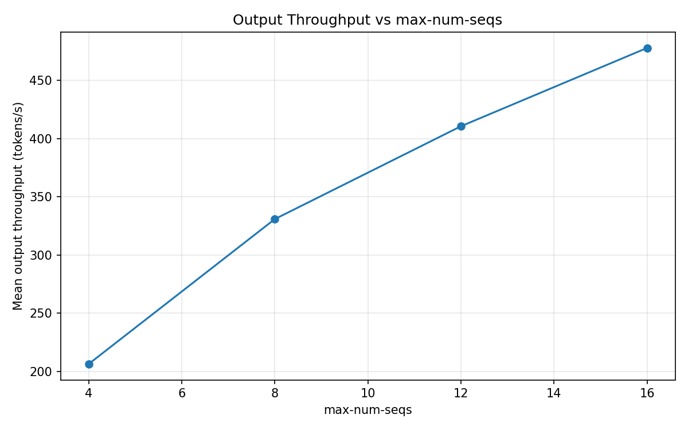
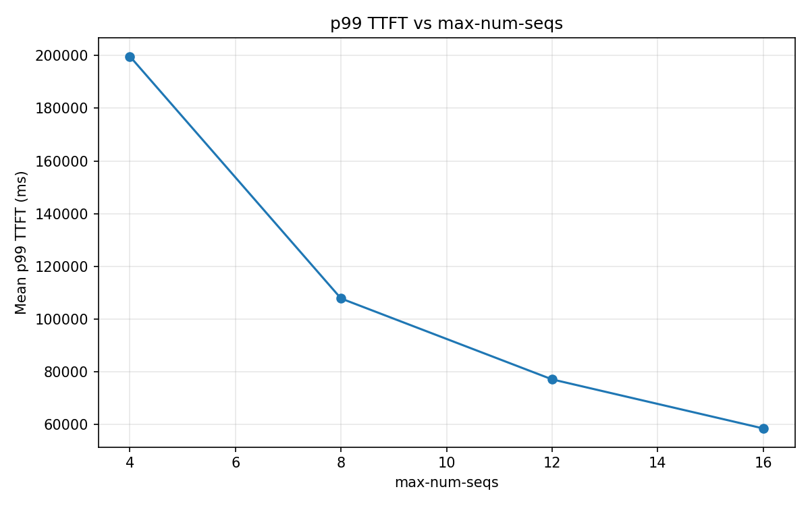
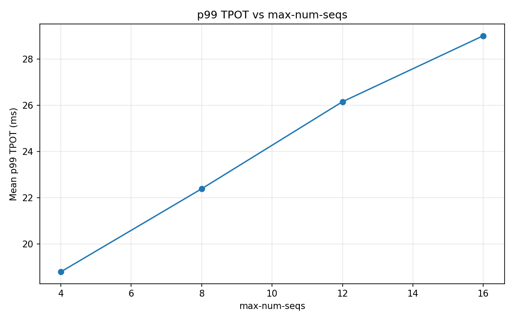
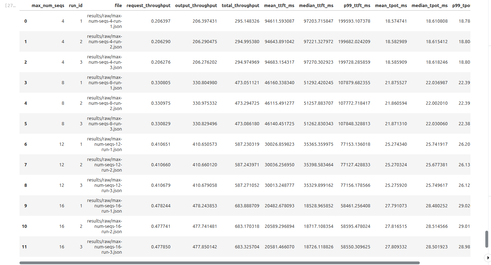
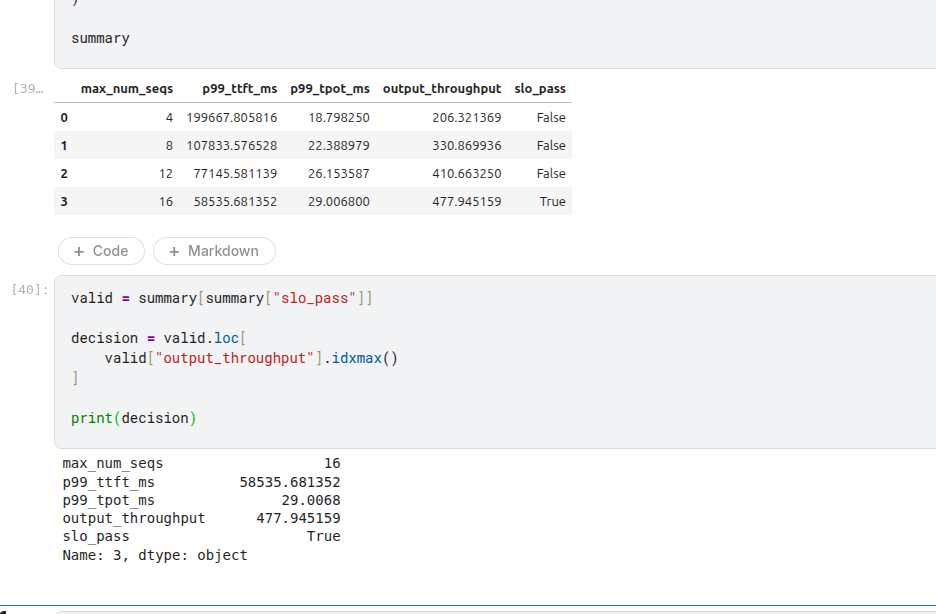
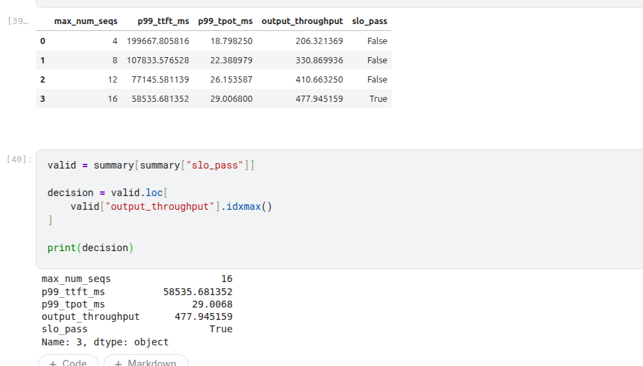
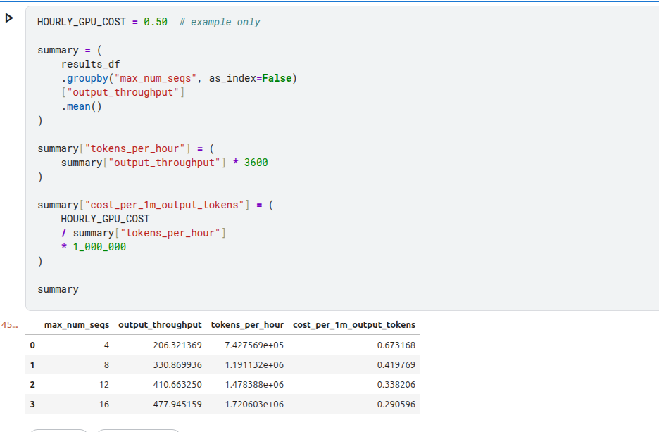

# LLM Inference Benchmark

[](https://github.com/vllm-project/vllm)
[](https://huggingface.co/Qwen/Qwen2.5-1.5B-Instruct)
[](#hardware)
[](#13-current-status)
[](#license)

A reproducible benchmark project for evaluating **vLLM inference performance on a single GPU**.

This experiment studies how changing `max-num-seqs` affects inference throughput and latency while keeping the model, GPU, workload, and all other vLLM configuration parameters fixed.

---

## Table of Contents

1. [Project Goal](#1-project-goal)
2. [Benchmark Configuration](#2-benchmark-configuration)
3. [Experiment Design](#3-experiment-design)
4. [Experiment Methodology](#4-experiment-methodology)
5. [Metrics](#5-metrics)
6. [Why `max-num-seqs`?](#6-why-max-num-seqs)
7. [Project Structure](#7-project-structure)
8. [Scripts](#8-scripts)
9. [Configuration Files](#9-configuration-files)
10. [Notebook](#10-notebook)
11. [Execution Environment](#11-execution-environment)
12. [Reproducibility](#12-reproducibility)
13. [Results](#13-results)
14. [Current Status](#14-current-status)
15. [Important Principle](#15-important-principle)
16. [Getting Started](#16-getting-started)
17. [License](#license)

---

## 1. Project Goal

The goal is to understand and measure the performance behavior of a production-style LLM inference server.

The experiment focuses on:

* vLLM inference serving
* GPU utilization
* GPU memory utilization
* request concurrency
* continuous batching
* throughput
* TTFT (Time To First Token)
* TPOT (Time Per Output Token)
* request queueing
* `max-num-seqs`

This project runs first as a **single-GPU inference benchmark**. Kubernetes/EKS orchestration benchmarking will be added as a separate phase once the inference benchmark is established (see [Phase 4](#14-current-status)).

---

## 2. Benchmark Configuration

### Model

```text
Qwen/Qwen2.5-1.5B-Instruct
```

### Hardware

```text
GPU:       Tesla T4
GPU count: 1
```

### vLLM

```text
Version:                 0.30.0
Tensor Parallel Size:   1
Pipeline Parallel Size: 1
Max Model Length:       2000
GPU Memory Utilization: 0.85
```

---

## 3. Experiment Design

The experiment changes only one variable:

```text
max-num-seqs
```

Test values:

```text
4
8
12
16
```

All other benchmark parameters remain fixed.

### Fixed workload

```text
Dataset:            random
Input length:       430 tokens
Output length:      1000 tokens
Number of prompts:  50
Request rate:       2 requests/second
Repetitions:        3
Warm-up:            enabled
```

The benchmark uses vLLM's random dataset with controlled input and output lengths. The `benchmark_prompt.txt` file is maintained separately for reference (token-count inspection) and is **not** used as the request dataset by `vllm bench serve`.

---

## 4. Experiment Methodology

For each `max-num-seqs` value:

```text
1. Start a fresh vLLM server
2. Set max-num-seqs
3. Allow the server to initialize
4. Run a warm-up pass
5. Run the benchmark workload (3 repetitions)
6. Save the raw benchmark result(s)
7. Stop the server
8. Repeat for the next max-num-seqs value
```

Conceptually:

```text
max-num-seqs = 4  → benchmark → result
max-num-seqs = 8  → benchmark → result
max-num-seqs = 12 → benchmark → result
max-num-seqs = 16 → benchmark → result
```

This isolates the effect of `max-num-seqs` rather than changing multiple variables at once. Each run produces a warm-up result plus three timed repetitions (`*-run-warmup.json`, `*-run-1.json`, `*-run-2.json`, `*-run-3.json`), which are aggregated into a single summary result per value (`max-num-seqs-<N>.json`) and consolidated into `benchmark-summary.csv`.

---

## 5. Metrics

The benchmark results are analyzed for:

* Output token throughput
* Request throughput
* TTFT (Time To First Token) — mean / p99
* TPOT (Time Per Output Token) — mean / p99
* Request latency
* Queue time
* GPU utilization
* GPU memory utilization
* Error rate

---

## 6. Why `max-num-seqs`?

`max-num-seqs` controls the maximum number of sequences that vLLM can schedule concurrently.

Increasing it can allow the GPU to process more active sequences and may improve throughput when the GPU is underutilized.

However, increasing concurrency can also increase:

* KV-cache memory pressure
* GPU memory consumption
* queueing behavior
* latency
* contention between requests

The goal is **not** simply to find the largest value — it is to measure the relationship between:

```text
max-num-seqs → concurrency → batching → GPU utilization → throughput → latency
```

---

## 7. Project Structure

```text
llm-inference-benchmark/
│
├── benchmark-results/
│   ├── benchmark-decision.png
│   ├── benchmark-test-pass-decision.png
│   ├── cost-analysis.png
│   ├── parse-benchmark-results.png
│   ├── plots/
│   │   ├── p99-tpot-vs-max-num-seqs.png
│   │   ├── p99-ttft-vs-max-num-seqs.png
│   │   └── throughput-vs-max-num-seqs.png
│   ├── results/
│   │   └── raw/
│   │       ├── benchmark-summary.csv
│   │       ├── max-num-seqs-4.json
│   │       ├── max-num-seqs-4-run-{warmup,1,2,3}.json
│   │       ├── max-num-seqs-8.json
│   │       ├── max-num-seqs-8-run-{warmup,1,2,3}.json
│   │       ├── max-num-seqs-12.json
│   │       ├── max-num-seqs-12-run-{warmup,1,2,3}.json
│   │       ├── max-num-seqs-16.json
│   │       └── max-num-seqs-16-run-{warmup,1,2,3}.json
│   └── vllm_server.log
│
├── configs/
│   └── baseline.yaml
│
├── notebooks/
│   └── vllm-inference-benchmark.ipynb
│
├── plots/
│
├── results/
│   └── raw/
│
├── scripts/
│   ├── count_prompt_tokens.py
│   ├── run_benchmark.sh
│   └── start_server.sh
│
├── workloads/
│   ├── prompts/
│   │   └── benchmark_prompt.txt
│   └── workload.yaml
│
├── README.md
└── .gitignore
```

> `results/` and `plots/` hold generated artifacts from the working notebook run; `benchmark-results/` holds the curated, committed outputs (raw JSON, aggregated CSV, and final plots/screenshots) referenced in this README.

---

## 8. Scripts

### `scripts/start_server.sh`

Starts a vLLM server with a selected `max-num-seqs` value; the rest of the server configuration stays fixed.

```bash
./scripts/start_server.sh 4
./scripts/start_server.sh 16
```

### `scripts/run_benchmark.sh`

Runs the vLLM benchmark against the running server and saves the result under `results/raw/`, named for the tested `max-num-seqs` value.

```bash
./scripts/run_benchmark.sh 4
```

### `scripts/count_prompt_tokens.py`

Loads the Qwen tokenizer and reports the character count and token count of `workloads/prompts/benchmark_prompt.txt`. This is a utility for inspecting the reference prompt, not the random benchmark workload.

```bash
python scripts/count_prompt_tokens.py
```

---

## 9. Configuration Files

| File | Purpose |
|---|---|
| `configs/baseline.yaml` | Baseline model, hardware, vLLM configuration, workload configuration, and experiment values. |
| `workloads/workload.yaml` | Documents the benchmark workload: 50 requests, 2 RPS, 430 input tokens, 1000 output tokens, 3 repetitions, warm-up enabled. |

---

## 10. Notebook

```text
notebooks/vllm-inference-benchmark.ipynb
```

Provides the end-to-end benchmark workflow:

```text
GPU verification
      ↓
vLLM setup
      ↓
vLLM server startup
      ↓
health check
      ↓
benchmark execution
      ↓
raw JSON results
      ↓
metric extraction
      ↓
summary table
      ↓
plots
      ↓
analysis
```

Designed to run in a GPU environment such as Kaggle.

---

## 11. Execution Environment

Development workflow:

```text
Local VS Code → Project development → GitHub → Kaggle GPU environment
      → Actual benchmark execution → Raw results → Analysis and plots
```

* **Development:** local, VS Code
* **Execution:** Kaggle, Tesla T4 GPU

---

## 12. Reproducibility

The benchmark keeps the following fixed across experiments:

```text
Model
GPU
vLLM version
Tensor parallelism
Pipeline parallelism
Max model length
GPU memory utilization
Input token length
Output token length
Request count
Request rate
Warm-up procedure
Benchmark repetitions
```

Only `max-num-seqs` is changed between primary experiment runs.

---

## 13. Results

Raw results live in [`benchmark-results/results/raw/`](benchmark-results/results/raw/), aggregated into [`benchmark-summary.csv`](benchmark-results/results/raw/benchmark-summary.csv). The full server log for the run is at [`benchmark-results/vllm_server.log`](benchmark-results/vllm_server.log).

### Throughput vs. `max-num-seqs`



### p99 TTFT vs. `max-num-seqs`



### p99 TPOT vs. `max-num-seqs`



### Benchmark parsing & decision workflow

| Parsing raw results | Pass/fail decision criteria | Final benchmark decision | Cost analysis |
|---|---|---|---|
|  |  |  |  |

> **Note:** These images are already committed under `benchmark-results/` in this repository and will render automatically on GitHub once this README is pushed alongside them. No benchmark numbers are hard-coded in the prose above — read the plots and `benchmark-summary.csv` for actual figures, and update this section with a short written takeaway (e.g. the `max-num-seqs` value that best balances throughput and p99 latency) once you've reviewed them.

---
