# LLM Inference Benchmark

[](https://github.com/vllm-project/vllm)
[](https://huggingface.co/Qwen/Qwen2.5-1.5B-Instruct)
[](#hardware)
[](#13-results)

A reproducible benchmark project for evaluating **vLLM inference performance across single-GPU and multi-GPU parallelism strategies**.

This experiment compares three parallelism configurations — single-GPU baseline, 2-GPU tensor parallelism, and 2-GPU pipeline parallelism — while sweeping `max-num-seqs` and request rate, to see how each strategy affects throughput and latency under load.

---

## Table of Contents

1. [Project Goal](#1-project-goal)
2. [Benchmark Configuration](#2-benchmark-configuration)
3. [Experiment Design](#3-experiment-design)
4. [Experiment Methodology](#4-experiment-methodology)
5. [Metrics](#5-metrics)
6. [Why Compare Parallelism Strategies?](#6-why-compare-parallelism-strategies)
7. [Project Structure](#7-project-structure)
8. [Scripts](#8-scripts)
9. [Configuration Files](#9-configuration-files)
10. [Notebook](#10-notebook)
11. [Execution Environment](#11-execution-environment)
12. [Reproducibility](#12-reproducibility)
13. [Results](#13-results)

---

## 1. Project Goal

The goal is to understand and measure the performance behavior of a production-style LLM inference server under different **parallelism strategies**.

The experiment focuses on:

* vLLM inference serving
* single-GPU vs. tensor-parallel vs. pipeline-parallel deployment
* GPU utilization (per-GPU)
* GPU memory utilization
* request concurrency (`max-num-seqs`)
* incoming request rate
* continuous batching
* throughput
* TTFT (Time To First Token)
* TPOT (Time Per Output Token)
* request queueing

Kubernetes/EKS orchestration benchmarking will be added as a separate phase once this inference benchmark is established (see [Current Status](#14-current-status)).

---

## 2. Benchmark Configuration

### Model

```text
Qwen/Qwen2.5-1.5B-Instruct
```

### Hardware

```text
GPU:       Tesla T4
GPU count: 2
```

### vLLM

```text
Version:                0.30.0
Max Model Length:       2000
GPU Memory Utilization: 0.85
```

### Parallelism configurations tested

| Config name | Tensor parallel size | Pipeline parallel size | GPUs used |
|---|---|---|---|
| `baseline_1gpu` | 1 | 1 | `[0]` |
| `tensor_parallel_2gpu` | 2 | 1 | `[0, 1]` |
| `pipeline_parallel_2gpu` | 1 | 2 | `[0, 1]` |

---

## 3. Experiment Design

The experiment sweeps two variables for each parallelism configuration above:

```text
max-num-seqs:  16, 64, 160
request-rate:  1, 2, 3   (requests/second)
```

All other benchmark parameters remain fixed.

### Fixed workload

```text
Dataset:            random
Input length:       430 tokens
Output length:      1000 tokens
Number of prompts:  50
Repetitions:        2
Warm-up:            enabled
```

The benchmark uses vLLM's random dataset with controlled input and output lengths. The `benchmark_prompt.txt` file is maintained separately for reference (token-count inspection) and is **not** used as the request dataset by `vllm bench serve`.

---

## 4. Experiment Methodology

For each parallelism config × `max-num-seqs` × `request-rate` combination:

```text
1. Start a fresh vLLM server with the given parallelism config and max-num-seqs
2. Allow the server to initialize (cold start)
3. Run a warm-up pass at the target request rate
4. Run the benchmark workload (2 timed repetitions)
5. Save the raw benchmark result(s) and GPU-utilization log
6. Stop the server
7. Repeat for the next combination
```

Each run produces a warm-up result plus two timed repetitions (`*-run-warmup.json`, `*-run-1.json`, `*-run-2.json`), which are consolidated into `benchmark-summary.csv`. Every server startup is also paired with a vLLM server log and a per-second GPU-utilization CSV under `logs/`.

---

## 5. Metrics

The benchmark results are analyzed for:

* Request throughput / output token throughput
* TTFT (Time To First Token) — mean / p99
* TPOT (Time Per Output Token) — mean / p99
* Mean queue time
* Cold-start time
* GPU utilization and memory usage (per GPU, over time)
* Completed vs. failed requests

---

## 6. Why Compare Parallelism Strategies?

* **Tensor parallelism** splits each layer's weights across GPUs, so every request is computed jointly by both GPUs — this reduces per-token latency but adds inter-GPU communication overhead.
* **Pipeline parallelism** splits the model's layers across GPUs, so different requests can be processed on different pipeline stages concurrently — this can raise throughput but adds pipeline bubble latency.
* **Single-GPU baseline** has no parallelism overhead but is limited by one GPU's compute and memory.

Sweeping `max-num-seqs` and request rate alongside these configs shows *where* each strategy's throughput/latency trade-off actually pays off, rather than assuming more GPUs always means better performance.

---

## 7. Project Structure

```text
llm-inference-benchmark/
│
├── benchmark-results/
│   ├── checkpoint.json
│   ├── logs/
│   │   ├── vllm-<config>-seqs<N>.log
│   │   └── gpu-util-<config>-seqs<N>.csv
│   ├── plots/
│   │   ├── throughput-vs-request-rate-<config>.png
│   │   ├── p99-ttft-vs-request-rate-<config>.png
│   │   └── p99-tpot-vs-request-rate-<config>.png
│   └── results/
│       └── raw/
│           ├── benchmark-summary.csv
│           ├── run-metadata.jsonl
│           └── <config>-max-num-seqs-<N>-rate-<R>-run-{warmup,1,2}.json
│
├── configs/
│   └── baseline.yaml
│
├── notebooks/
│   └── llm-inference-benchmark.ipynb
│
├── scripts/
│   ├── count_prompt_tokens.py
│   ├── run_benchmark.sh
│   └── start_server.sh
│
├── workloads/
│   ├── prompts/
│   │   └── benchmark_prompt.txt
│   └── workload.yaml
│
├── README.md
└── .gitignore
```

`<config>` is one of `baseline_1gpu`, `tensor_parallel_2gpu`, `pipeline_parallel_2gpu`; `<N>` is `16`, `64`, or `160`; `<R>` is request rate `1`, `2`, or `3`.

---

## 8. Scripts

### `scripts/start_server.sh`

Starts a vLLM server with a selected parallelism config and `max-num-seqs` value; the rest of the server configuration stays fixed.

```bash
./scripts/start_server.sh baseline_1gpu 64
./scripts/start_server.sh tensor_parallel_2gpu 160
```

### `scripts/run_benchmark.sh`

Runs the vLLM benchmark against the running server at a given request rate and saves the result under `results/raw/`, named for the tested config, `max-num-seqs`, and rate.

```bash
./scripts/run_benchmark.sh tensor_parallel_2gpu 64 2
```

### `scripts/count_prompt_tokens.py`

Loads the Qwen tokenizer and reports the character count and token count of `workloads/prompts/benchmark_prompt.txt`. This is a utility for inspecting the reference prompt, not the random benchmark workload.

```bash
python scripts/count_prompt_tokens.py
```

---

## 9. Configuration Files

| File | Purpose |
|---|---|
| `configs/baseline.yaml` | Model, hardware, vLLM version, the 3 parallelism configs, `max-num-seqs`/`request-rate` sweep values, repetitions, SLO thresholds (TTFT/TPOT), and GPU cost inputs. |
| `workloads/workload.yaml` | Documents the benchmark workload: 50 requests, request rates of 1/2/3 RPS, 430 input tokens, 1000 output tokens, 2 repetitions, warm-up enabled. |

---

## 10. Notebook

```text
notebooks/llm-inference-benchmark.ipynb
```

Provides the end-to-end benchmark workflow:

```text
GPU verification
      ↓
vLLM setup
      ↓
vLLM server startup (per parallelism config)
      ↓
health check
      ↓
benchmark execution (per max-num-seqs × request-rate)
      ↓
raw JSON results + GPU-util logs
      ↓
metric extraction
      ↓
summary table (benchmark-summary.csv)
      ↓
plots
      ↓
analysis
```

Designed to run in a GPU environment such as Kaggle.

---

## 11. Execution Environment

Development workflow:

```text
Local VS Code → Project development → GitHub → Kaggle GPU environment
      → Actual benchmark execution → Raw results → Analysis and plots
```

* **Development:** local, VS Code
* **Execution:** Kaggle, 2x Tesla T4 GPU

---

## 12. Reproducibility

The benchmark keeps the following fixed across experiments:

```text
Model
GPU type
vLLM version
Max model length
GPU memory utilization
Input token length
Output token length
Request count
Warm-up procedure
Benchmark repetitions
```

Only **parallelism config**, **`max-num-seqs`**, and **`request-rate`** are varied between runs.

---

## 13. Results

Raw results live in [`benchmark-results/results/raw/`](benchmark-results/results/raw/), aggregated into [`benchmark-summary.csv`](benchmark-results/results/raw/benchmark-summary.csv), with per-run metadata in [`run-metadata.jsonl`](benchmark-results/results/raw/run-metadata.jsonl). Per-run vLLM server logs and GPU-utilization CSVs are under [`benchmark-results/logs/`](benchmark-results/logs/).

### Throughput vs. request rate

| Baseline (1 GPU) | Tensor Parallel (2 GPU) | Pipeline Parallel (2 GPU) |
|---|---|---|
| 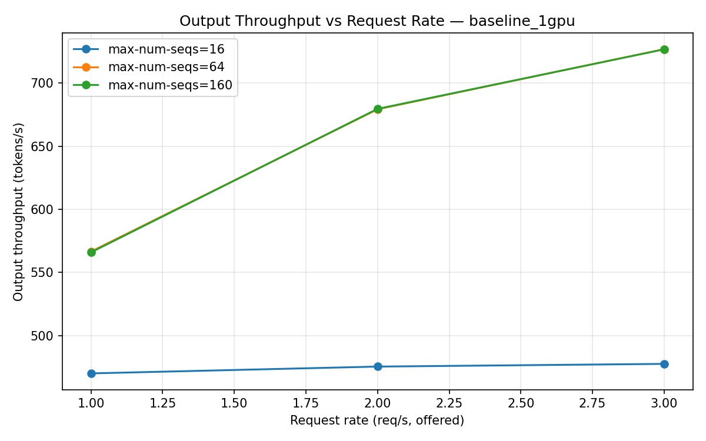 | 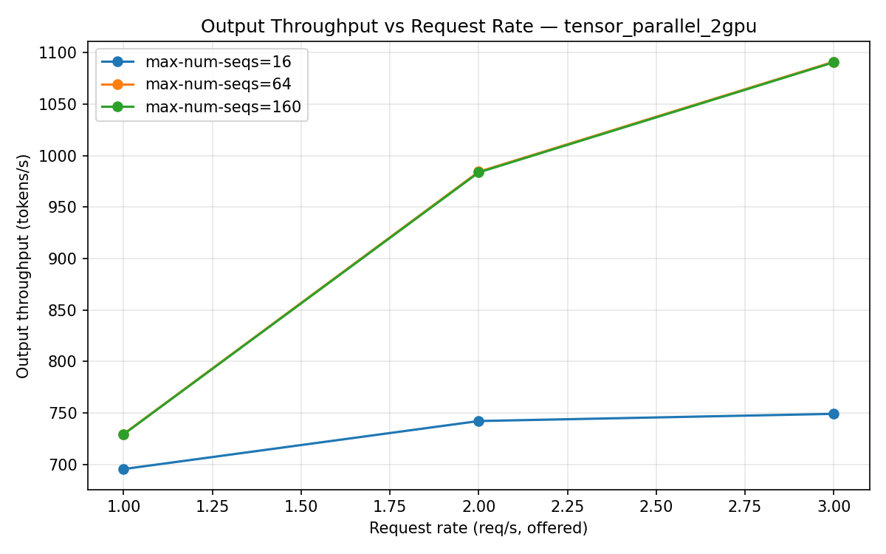 | 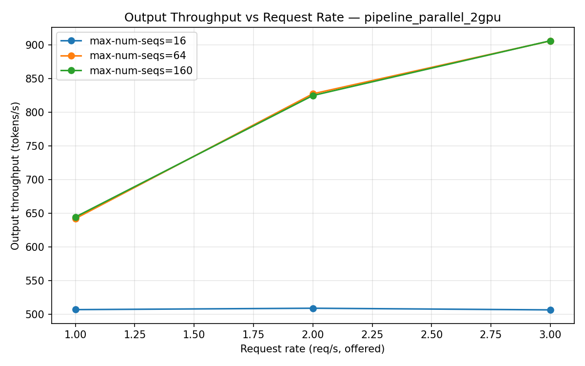 |

### p99 TTFT vs. request rate

| Baseline (1 GPU) | Tensor Parallel (2 GPU) | Pipeline Parallel (2 GPU) |
|---|---|---|
| 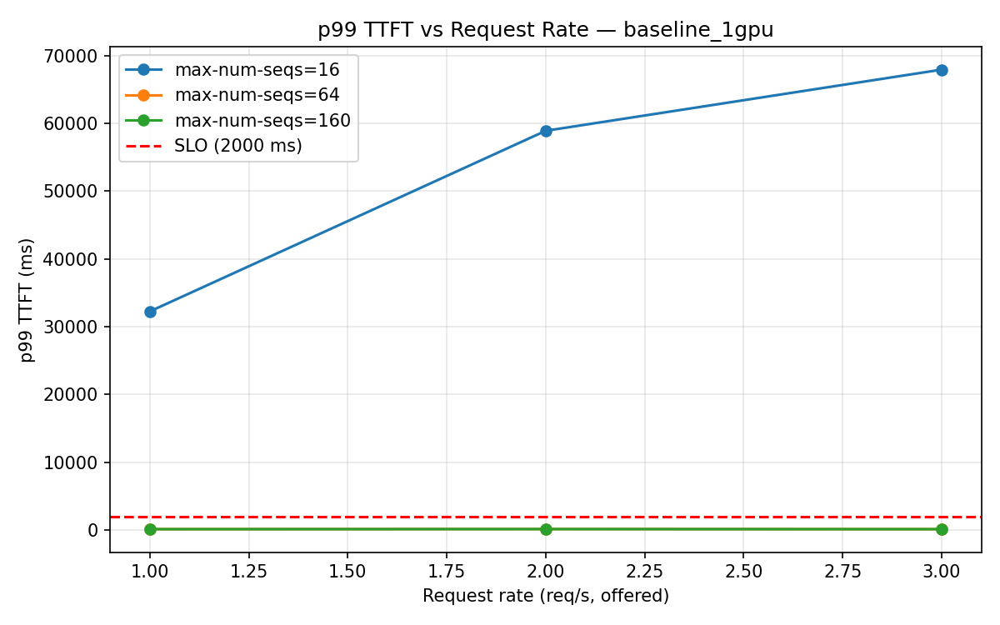 | 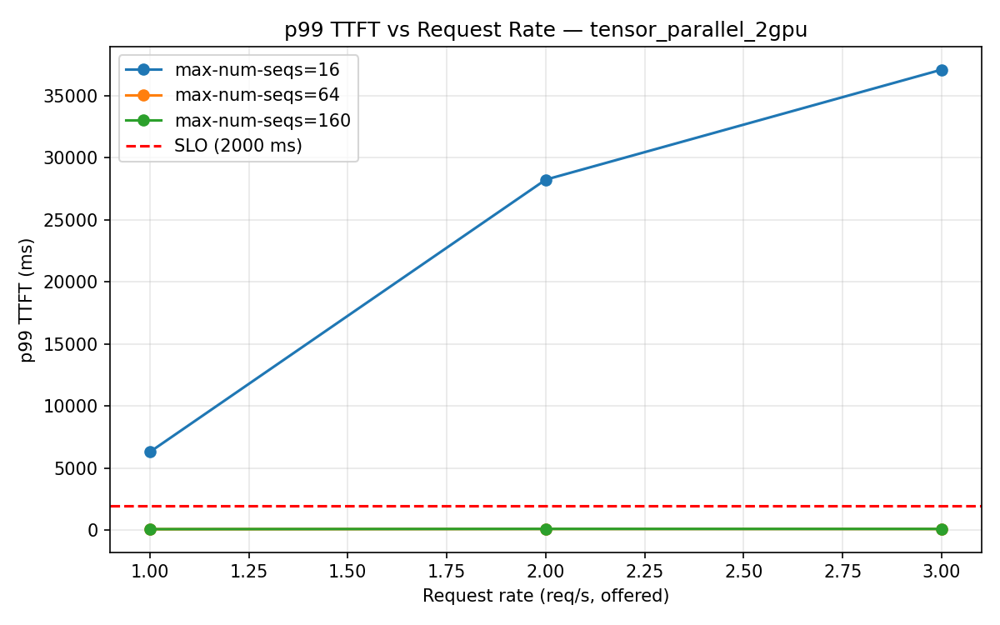 | 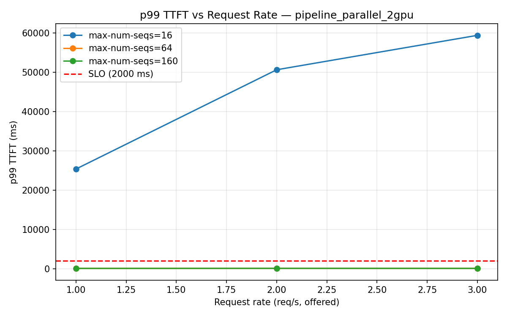 |

### p99 TPOT vs. request rate

| Baseline (1 GPU) | Tensor Parallel (2 GPU) | Pipeline Parallel (2 GPU) |
|---|---|---|
| 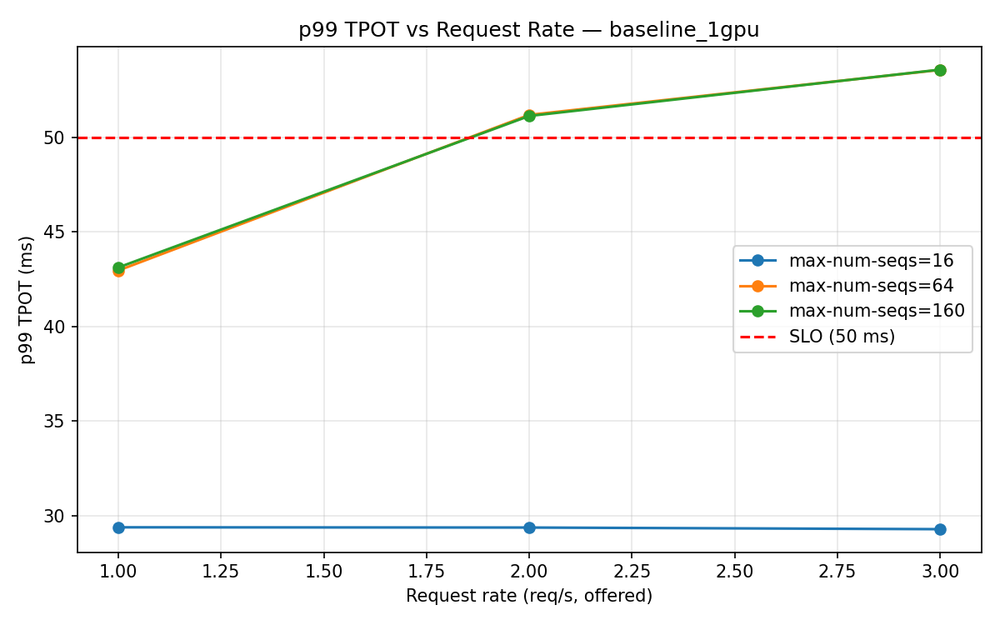 | 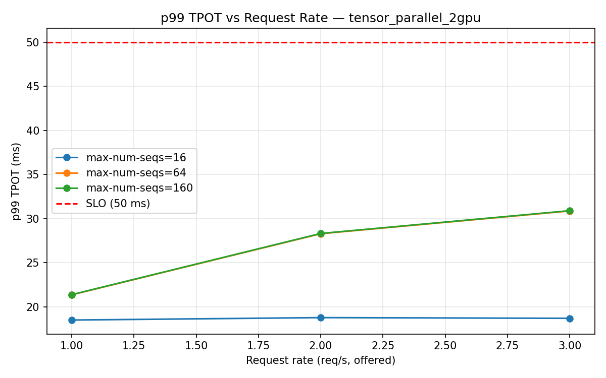 | 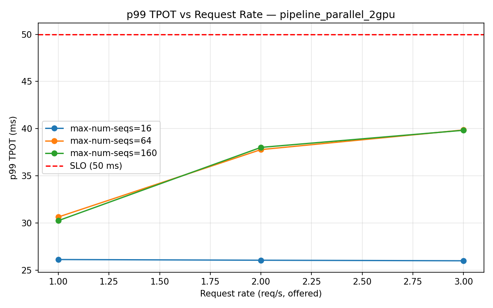 |

### Summary (averaged over timed repetitions, warm-up excluded)

| Config | max-num-seqs | Rate (req/s) | Output tok/s | p99 TTFT (ms) | p99 TPOT (ms) |
|---|---|---|---|---|---|
| baseline_1gpu | 16 | 3 | 478 | 67,916 | 29.3 |
| baseline_1gpu | 64 | 3 | 727 | 146 | 53.6 |
| baseline_1gpu | 160 | 3 | 727 | 147 | 53.6 |
| pipeline_parallel_2gpu | 16 | 3 | 507 | 59,389 | 26.0 |
| pipeline_parallel_2gpu | 64 | 3 | 906 | 96 | 39.9 |
| pipeline_parallel_2gpu | 160 | 3 | 906 | 94 | 39.8 |
| tensor_parallel_2gpu | 16 | 3 | 749 | 37,077 | 18.7 |
| tensor_parallel_2gpu | 64 | 3 | 1091 | 113 | 30.9 |
| tensor_parallel_2gpu | 160 | 3 | 1091 | 111 | 30.9 |

No requests failed in any run (`failed = 0` across all 81 timed + warm-up runs).

**Takeaway:** at `max-num-seqs = 16`, concurrency is the bottleneck for all three configs — requests queue up and p99 TTFT balloons into tens of seconds as request rate rises. Once `max-num-seqs` is raised to 64 (no further gain at 160), queueing disappears and each config's real throughput ceiling shows: **`tensor_parallel_2gpu` gives the highest throughput and lowest p99 TPOT**, `pipeline_parallel_2gpu` is a middle ground, and `baseline_1gpu` is the throughput floor. Full per-run numbers are in `benchmark-summary.csv`; GPU-level utilization behind these numbers is in `logs/gpu-util-*.csv`.

### SLO pass, goodput & cost analysis

An SLO of **TTFT < 2000 ms** and **TPOT < 50 ms** is applied to every run to compute **goodput** (throughput counted only from requests that meet the SLO), the max sustainable request rate per config, and cost per 1M output tokens.

| SLO pass & goodput per run | Max sustainable QPS per config | Cost per 1M output tokens |
|---|---|---|
| 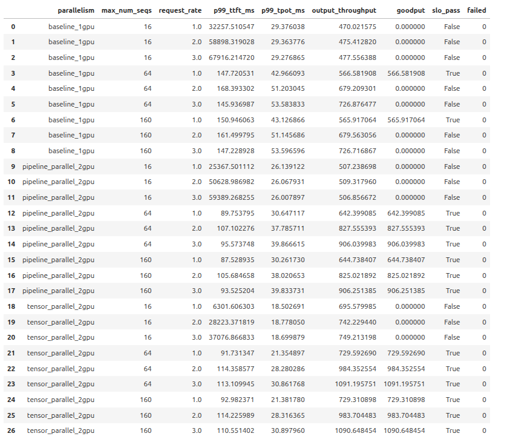 | 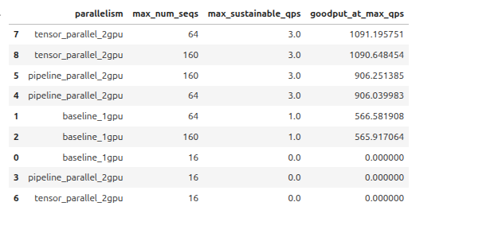 | 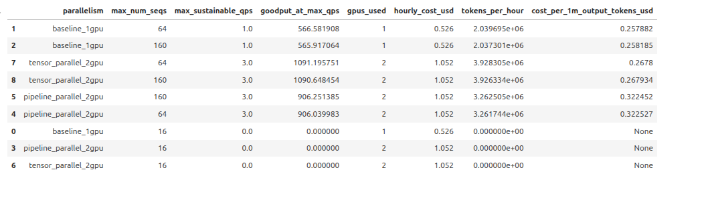 |

**Takeaway:**
* At `max-num-seqs = 16`, every config **fails the SLO** at every request rate (goodput = 0) — TTFT queueing alone blows past the 2000 ms budget.
* At `max-num-seqs ≥ 64`, `tensor_parallel_2gpu` sustains up to **3 req/s with ~1091 tok/s goodput**, `pipeline_parallel_2gpu` sustains 3 req/s at ~906 tok/s, while `baseline_1gpu` only sustains **1 req/s** (~566 tok/s) before its TPOT breaches 50 ms.
* On cost per 1M output tokens, `baseline_1gpu` is the cheapest (~$0.258) but caps out at the lowest goodput ceiling; `tensor_parallel_2gpu` costs ~4% more per token (~$0.268) for roughly **2x the sustainable goodput** — the better choice whenever throughput headroom matters more than the small per-token cost delta.

---